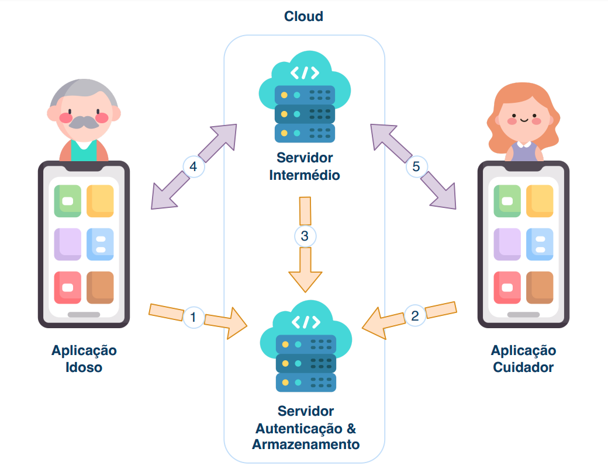

# Gestor de palavras-passe acessível para idosos

## Introdução

Com o crescimento das plataformas online, a necessidade de autenticação em múltiplas contas tornou-se um problema, especialmente para os utilizadores mais idosos, que enfrentam desafios significativos. As dificuldades cognitivas associadas à idade tornam a memorização de várias palavras-passe mais difícil, levando muitas vezes à reutilização das mesmas ou à escolha de combinações demasiado simples, o que compromete seriamente a segurança online.

Neste projeto, investigamos soluções que pudessem facilitar o processo de autenticação para os idosos. Apesar de já existirem métodos como autenticação através de som, desenhos ou tokens, estes apresentam algumas limitações. A necessidade de alterar os sistemas existentes para integrar estes métodos, a demora no processo de autenticação e a dependência de dispositivos adicionais são alguns exemplos dessas limitações.

Com base num design centrado no utilizador e prototipagem iterativa, desenvolvemos um gestor de palavras-passe com a participação de 9 idosos e um perito ao longo do desenvolvimento. Aplicámos algoritmos como o Signal e o Secret Sharing para garantir a segurança dos dados dos utilizadores, permitindo o armazenamento seguro das credenciais na Cloud e a sua interpretação pelos cuidadores.

O protótipo final foi avaliado com 17 idosos utilizando o questionário System Usability Scale (SUS). Obtivemos um valor médio de 81.3, sugerindo que o nosso protótipo é fácil de utilizar pelo público-alvo.

---

## Objetivos do projeto

Este trabalho teve como principal objetivo desenvolver um gestor de palavras-passe destinado a ser utilizado por idosos, algo solicitado por esta faixa etária. Pretende-se que o sistema ajude a resolver desafios e riscos relacionados com a privacidade e segurança dos idosos no mundo online, garantindo a segurança das suas credenciais e auxiliando na sua manutenção. Em seguida, apresentamos os principais sub-objetivos deste projeto:

- Identificar soluções de autenticação desenvolvidas para idosos ou que possam beneficiar esta faixa etária, explorando alternativas às palavras-passe e métodos auxiliares para a gestão das credenciais.
- Desenvolver um sistema que os idosos utilizem sem qualquer limitação, onde possam gerir as suas credenciais e beneficiar da ajuda de um cuidador informal neste processo, uma vez que estes consideram os familiares peças fundamentais para a adoção destas tecnologias. A presença de alguém de confiança neste processo é essencial.
- Implementar mecanismos de criptografia que assegurem que as credenciais dos utilizadores estejam devidamente protegidas tanto na Cloud quanto localmente nos dispositivos dos utilizadores. Adicionalmente, pretende-se garantir que os dados confidenciais armazenados no sistema sejam trocados de forma segura entre os idosos e os cuidadores, bem como assegurar que é possível realizar a recuperação segura das credenciais dos idosos.
- Incluir o público-alvo e um perito durante o desenvolvimento do sistema, bem como avaliar o protótipo final com esse público. Isso é essencial para assegurar que a interface do gestor considere as características da população idosa.

---
## Contribuições

O presente trabalho contribui para a área da segurança digital, com o desenvolvimento de um gestor de palavras-passe projetado para atender às necessidades dos idosos. Este sistema facilita o armazenamento seguro e a gestão de credenciais, abrangendo tanto logins em plataformas online como informações sensíveis de cartões, garantindo uma solução adaptada ao perfil dos utilizadores mais velhos.

Entre as funcionalidades principais do sistema, destaca-se a geração de palavras-passe fortes e a verificação automática da sua robustez. O sistema permite a criação de vínculos entre os idosos e os seus cuidadores informais, oferecendo assistência remota na gestão de credenciais. Esta funcionalidade atua como uma medida de segurança adicional, permitindo que os cuidadores ajudem os idosos caso estes percam o acesso ao sistema.

Para garantir a privacidade e segurança dos dados, foram implementadas técnicas avançadas, como o Secret Sharing e o protocolo Signal. O Secret Sharing assegura que as chaves criptográficas, utilizadas para cifrar as credenciais presentes na Cloud, nunca sejam armazenadas pelos cuidadores, protegendo assim a confidencialidade das informações partilhadas. O algoritmo Signal permite que os dados trocados entre as aplicações estejam devidamente protegidos. Além disso, o sistema inclui tutoriais em vídeo e texto, respostas a perguntas frequentes e recomendações de boas práticas de segurança. Estas funcionalidades foram desenvolvidas com o objetivo de maximizar a adesão dos idosos.

A interface desenvolvida foi orientada por requisitos recolhidos da literatura, pelas avaliações heurísticas realizadas por um perito e pelas interações com os idosos ao longo do desenvolvimento. Este processo assegurou o alinhamento do sistema com as melhores práticas de usabilidade e segurança, garantindo a eficácia e adequação da solução às necessidades dos idosos, promovendo um ambiente digital mais seguro e acessível para todos.

---
## Arquitetura do sistema

A seguinte figura apresenta a arquitetura do sistema proposta para que estes sejam cumpridos. A arquitetura é constituída por duas aplicações móveis distintas, e por dois servidores, o Servidor Intermédio que gere a comunicação entre duas aplicações, e o Servidor de Autenticação e Armazenamento, responsável pela autenticação e armazenamento. Na comunicação entre os componentes, existem dois tipos de comunicação disponíveis. Hypertext Transfer Protocol (HTTP), utilizado para enviar e obter dados armazenados nos servidores, representado pelos números 1, 2, 3, e WebSocket, necessário para comunicação bidirecional em tempo real, representado pelos números 4 e 5.



---
## Obter o PDF do Trabalho

Para obter mais informações sobre o trabalho realizado neste projeto, pode consultar o PDF diretamente [aqui](docs/tese.pdf), onde encontrará todos os detalhes.

---
## Como correr 
`Requisitos:` 
- Possuir o Node.js instalado na sua máquina. Na instalação do Node, o NPM (Node Package Manager) vem também instalado. Para verificar se possui o Node e o NPM instalados, basta correr os comandos `node -v` e `npm -v` numa linha de comandos.
- Possuir um Simulador instalado no seu dispositivo, sendo possível utilizar qualquer um dos sistemas operativos.
- Possua o código fonte do servidor intermédio e de ambas as aplicações aberto no seu IDE favorito. (Devido ao recurso ao React Native Expo, não é necessário abrir nenhum IDE específico de nenhum sistema operativo.

`Preparar e executar o sistema:` 
- Criar um projeto na [Firebase](https://firebase.google.com/) e registar uma aplicação neste mesmo projeto. Verifica com registar as aplicações [aqui](https://firebase.google.com/docs/web/setup?hl=pt&authuser=0). No processo de registo da aplicação é necessário copiar os dados do objeto `firebaseConfig` disponibilizado pela Firebase para o código fonte de ambas aplicações, nomeadamente para o ficheiro `src/firebase/FirebaseConfig.tsx` presente em ambas as aplicações. Nota: Ao registar uma aplicação na Firebase, é possível utilizar o mesmo objeto `firebaseConfig` para múltiplas aplicações, onde, no nosso caso, será para a aplicação do idoso e a aplicação do cuidador.

- Em seguida, é necessário gerar uma chave privada para ser colocada no Servidor Intermédio, para que este seja administrator da Firebase. Para tal, diriga-se às configurações do projeto no portal da [Firebase](https://firebase.google.com/), e em `Contas de serviço` é necessário gerar uma nova chave privada. Uma vez gerada, sendo esta um ficheiro .JSON, atualize o ficheiro `admin/privatekey.json` presente no servidor.

- Na Firestore, a base de dados da Firebase também acessível através do portal, na opção `Regras`, atualize as regras de acesso à mesma com as que se encontram descritas na próxima secção deste ficheiro readme.

- Na raiz do projeto do servidor, e nas raizes dos projetos de ambas as aplicações, abra um terminal e execute o comando `npm install` para que o NPM instale todas as dependências das três identidades do nosso sistema. Após a conclusão da execução deste comando, é possível verificar a presença, nos diretórios raiz das três identidades, um novo ficheiro denominado por `package-lock.json` e uma nova pasta denominada por `node_modules`.

- Na raíz das três identidades, execute o comando `npm start`, que por sua vez vai executar as respetivas aplicações e servidor, sendo que, no caso das aplicações, será ainda questionado relativamente a qual simulador pretende utilizar, tendo em conta aqueles que possui instalados.

---
## Regras definidas na Firebase Firestore
```
rules_version = '2';
service cloud.firestore {
  match /databases/{database}/documents {
  
  	match /Server/{serverId} {
     allow read: if true;
     allow write: if request.auth.token.admin == true;
    }
  
    match /Elderly/{elderlyId} {
     allow read, write: if request.auth != null; 
     
     //Função que retorna os utilizadores que podem ler os dados.
     //O identificador do cuidador é inserido no array readCaregivers no momento da vinculação
     //e é retirado se ocorrer uma desvinculação com o respetivo.
     function caregiverCanRead(userId) {
        return (exists(/databases/$(database)/documents/Elderly/$(elderlyId)/Caregivers/Value) &&
        get(/databases/$(database)/documents/Elderly/$(elderlyId)/Caregivers/Value).data.readCaregivers.hasAny([userId]))
     }
     
     //Função para obter os cuidadores que possuem permissões de escrita nas credenciais.
     //O cuidador é inserido neste array writeCaregivers caso lhe seja dada a permissão para atualizar
     //e criar as credenciais, e é retirado do array se ocorrer uma desvinculação ou caso o idoso
     //considere que tenha que lhe retirar as devidas permissões.
     function caregiverCanWrite(userId) {
        return (exists(/databases/$(database)/documents/Elderly/$(elderlyId)/Caregivers/Value) &&
        get(/databases/$(database)/documents/Elderly/$(elderlyId)/Caregivers/Value).data.writeCaregivers.hasAny([userId]))
     }
     
     match /Caregivers/{documents=**} {
     	allow read: if request.auth != null; 
      allow write: if request.auth.uid == elderlyId;
     }
     
     match /Key/{documents=**} {
     	allow read: if request.auth.uid == elderlyId || caregiverCanRead(request.auth.uid);
      allow write: if request.auth.uid == elderlyId;
     }
     
      match /Salt/{documents=**} {
     		allow read, write: if request.auth.uid == elderlyId;
     	}
      
     match /Credentials/{documents=**} {
     	allow read: if (request.auth.uid == elderlyId) || caregiverCanRead(request.auth.uid);
     	allow create, update: if (request.auth.uid == elderlyId) || caregiverCanWrite(request.auth.uid);
      allow delete: if (request.auth.uid == elderlyId)
     }
    }
    
    match /Caregiver/{caregiverId} {
    	allow read, write: if request.auth != null;
      
      match /Credentials/{documents=**} {
     	 	allow read, write: if request.auth.uid == caregiverId;
     	}	
      
      match /Salt/{documents=**} {
     		allow read, write: if request.auth.uid == caregiverId;
     	}
    }
	}
}
```

---

## Vídeos

Nesta secção apresentamos alguns vídeos que auto explicam algumas das funcionalidades presentes no sistema.

- [Atualização de dados pessoais](https://youtube.com/shorts/oWlcnEAocQk?feature=share)
- [Esclarecimento de dúvidas (tutoriais, perguntas frequentes, e sugestões)](https://youtube.com/shorts/CeJt7tGdHSI?feature=share)
- [Adicionar uma credencial](https://youtube.com/shorts/k7UR6cc1ZZU?feature=share)
- [Editar os dados de uma credencial](https://youtube.com/shorts/5cx4nst7zHA?feature=share)
- [Criar conta](https://youtube.com/shorts/cghj78ZZBU8?feature=share)
- [Gerador de palavras-passe fortes](https://youtube.com/shorts/Spp0JHPM5nY?feature=share)
- [Relação Idoso -> Cuidador](https://youtu.be/KUfIH4QxwBw)
- [Relação Cuidador -> Idoso](https://youtu.be/a6pa9yls1Hg)

---

## Contacto

Para questões ou sugestões, sinta-se à vontade para entrar em contacto através de joaopedro.arcanjo@hotmail.com.

---
